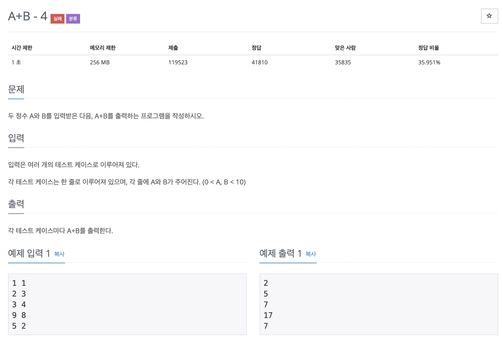

# A+B-4

## 문제 분석
* 테스트케이스가 주어지지 않은 경우

---

## 소스코드1 - c++

### 알고리즘
* while문의 조건문으로 입력 받는 구문을 구성시킨다.

~~~
#include <iostream>
using namespace std;

int main(){

    int a, b;

    while(cin >> a >> b){
        cout << a+b << endl;
    }

    return 0;
}
~~~