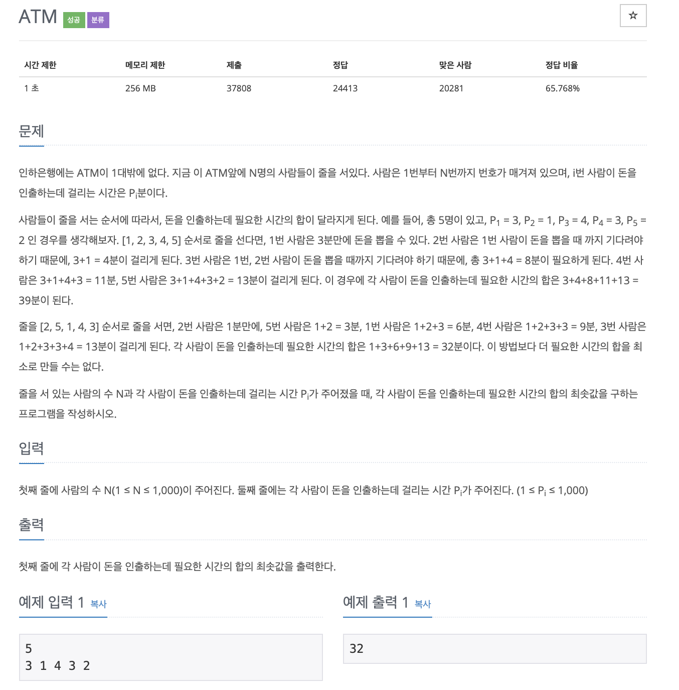

# ATM

## 문제 분석 
* 배열의 원소를 첫번째 부터 탐색이 진행된다. 이때 끝 원소까지 탐색이 진행되는 동안 접근하는 모든 원소의 합을 구하게 된다. 각 반복마다 계산한 합을 모두 더한 최솟값을 구하는 문제이다. 
* 각 반복마다 가장 적은 수를 더하는 방법(가장 좋은 것을 선택)으로 문제를 해결한다.

---

## 소스코드1

### 알고리즘
* 

~~~
n = int(input())

time = list(map(int,input().split())) 

# 오름차순 정렬
time.sort()
sum = 0

for i in range(n):
    for j in range(i+1):
       sum += time[j] 

print(sum)
~~~