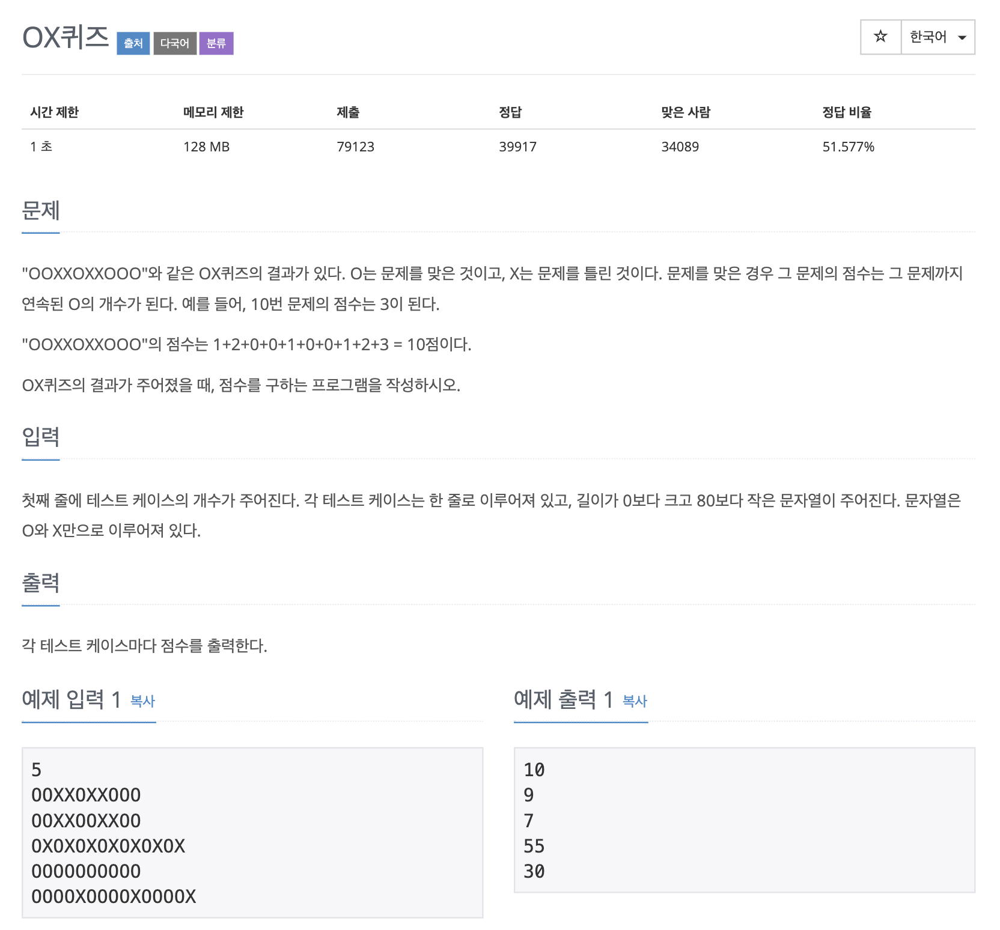

# OX 퀴즈

## 문제 분석 
* 이전의 값들을 저장한 후 더하는 형태

---

## 소스코드 1 - c++

### 알고리즘
* 현재위치 값을 담을 변수와 이전까지 값의 총합을 담을 변수 2개를 둔다.

~~~
#include <iostream>
#include <cstring>
using namespace std;

int main(){

    int count, len;  // 테스트 케이스, 문자열 길이
    int score, curr_score, total_score;  //매 단계마다 총점, 현재 문자의 총점
    char str[80];  //문자열 저장 변수

    cin >> count;

    int array[count];

    for(int i = 0; i < count; i++){

        cin >> str;  // 문자열 입력
        len = strlen(str);
        score = 0;
        curr_score = 0;
        total_score = 0;

        for(int j = 0 ;j < len; j++){
            if(str[j]=='O'){
                curr_score += 1;  //현재 위치 점수 값
                score += (curr_score);  //현재 위치의 총점 계산
            }else{
              total_score += score;
              score = 0;
              curr_score = 0;
            }
        }
        array[i] = total_score+score;
    }

    for(int i = 0; i < count; i++)
      cout << array[i] << endl;

    return 0;
}
~~~

