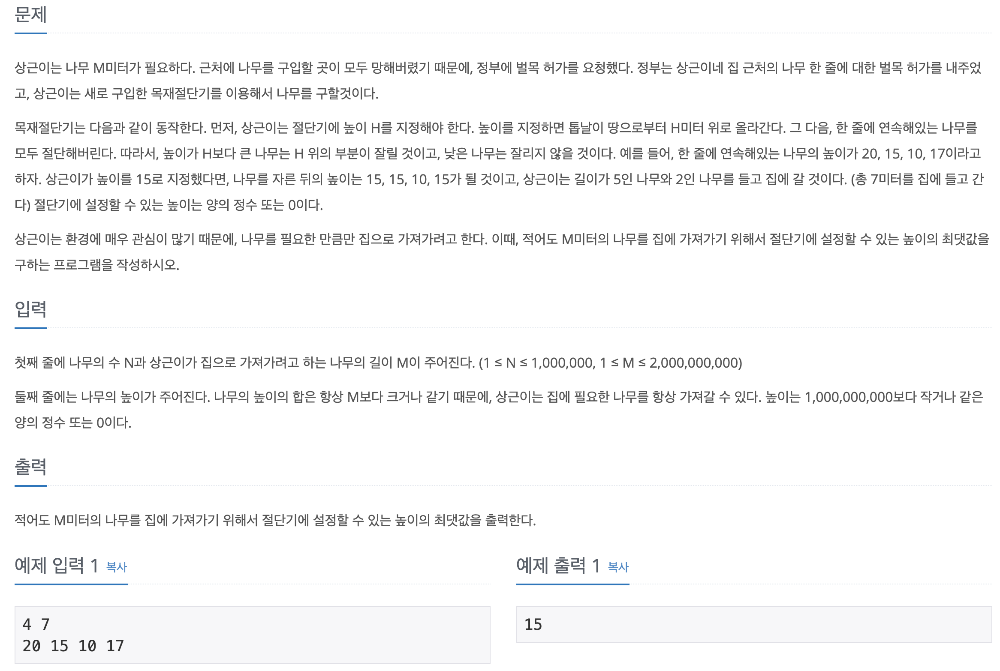

# 나무 자르기

## 문제 분석
* 파라메트릭 문제로 이진 탐색을 통해서 대상을 가장 큰 값으로 설정해 최대 또는 최소 값 형태로 자르는 문제이다.
* 나무 수(N), 원하는 나무 길이(M), 주어진 나무의 길이들이 조건이다. 

---

## 소스코드 1

### 알고리즘
* 가장 값이 큰 나무 길이를 이진 탐색의 대상으로 설정한다. 이때 탐색 조건은 mid를 통해 잘려진 나무 길이 합과 주어진 원하는 나무 길이 M이다. 
* 파라메트릭 문제 형태로 최소, 최대 값을 계산할 때는 반북문 while을 반복문 조건이 만족할 때까지 마지막까지 진행된다. 기본 이진 탐색 알고리즘은 target 값을 찾으면 중단하지만 이와는 다르다. 

~~~
import sys
n, m = map(int,sys.stdin.readline().split())

heights = list(map(int, input().split()))

start = 0
end = max(heights)

while start <= end:

  total = 0
  mid = (start+end)//2

  for height in heights:
    if height > mid:
      total += height - mid
  
  if total >= m:
    result = mid
    start = mid+1
  else:
    end = mid - 1

print(result)
~~~
