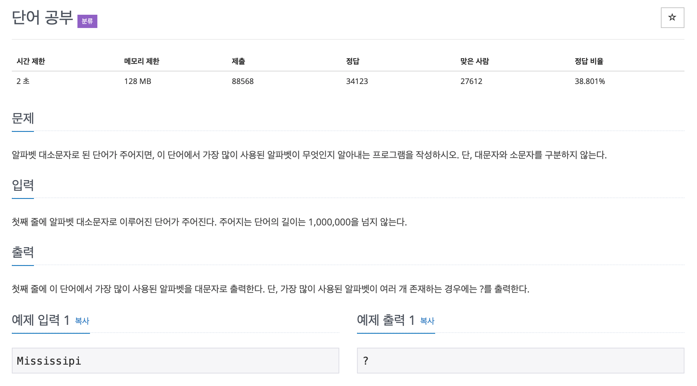

# 단어 공부

---

## 소스코드1 - c++ -> 시간초과

### 알고리즘
* 글자수 만큼 동적 배열 생성
* 문자열에서 인덱스를 기준으로 array 배열에 대응하게 설정후 개수 계산

~~~
#include <iostream>
#include <string>
#include <algorithm>

using namespace std;

int main(){

    string str;
    getline(cin, str);

    int len = str.length();
    int *array = new int[len];  // 동적 배열

    // 대문자로 변경
    for(int i = 0; i<len;i++){
      if(str[i] > 'Z')
        str[i] = str[i] - ('a'-'A');
    }

    array[0] = 1;

    int i = 1;
    while(i < len){ 
      for(int j = 0; j < i; j++){
        if(str[j] == str[i]){
          array[j] += 1;
        }
      }
      i++;
    }

    // 배열 값 중 최대값 찾기
    int max_count = 0, cur;
    int k = 0;
    while(k < len){
      if(array[k] != 0){
        cur = array[k];
        if(cur > max_count)
          max_count = cur;
      }
      k++;
    }

    // 최댓값 갖고 있는 배열의 인덱스 탐색
    int index1, index2 = -1;
    for(int i = 0; i<len; i++){
      if(array[i] == max_count){
        index1 = i;
        if(index2 == -1){
          index2 = index1;
        }else{
          cout << '?';
          return 0;
        }
      }
    }

    cout << str[index1];
  

    return 0;
}
~~~

---

## 소스코드2 - c++

### 알고리즘
* 모든 단어들에 대한 개수를 담을 배열 선언

~~~
#include <iostream>
#include <string>
using namespace std;

int main(){
    
    string str;
    int arr[26] = {0, };
    int max_cnt = 0;
    int index = 0;
    int count = 0;

    cin > str;

    for(int i = 0; i < str.length(); i++){
        int n = str.at(i);  //i 인덱스에 존재하는 문자 탐색
        if(n<97)
            arr[n-65]++;
        else
            arr[n-97]++;
    }

    for(int i = 0; i< 26; i++){
        if(arr[i] > max_cnt){
            max_cnt = arr[i];
            index = i;
        }
    }

    for(int i = 0; i<26; i++){
        if(arr[i] == max_cnt){
            count++;
            if(count >= 2){
                cout << "?" << endl;
                return 0;
            }
        }
    }
    return 0 ;
}
~~~

---

