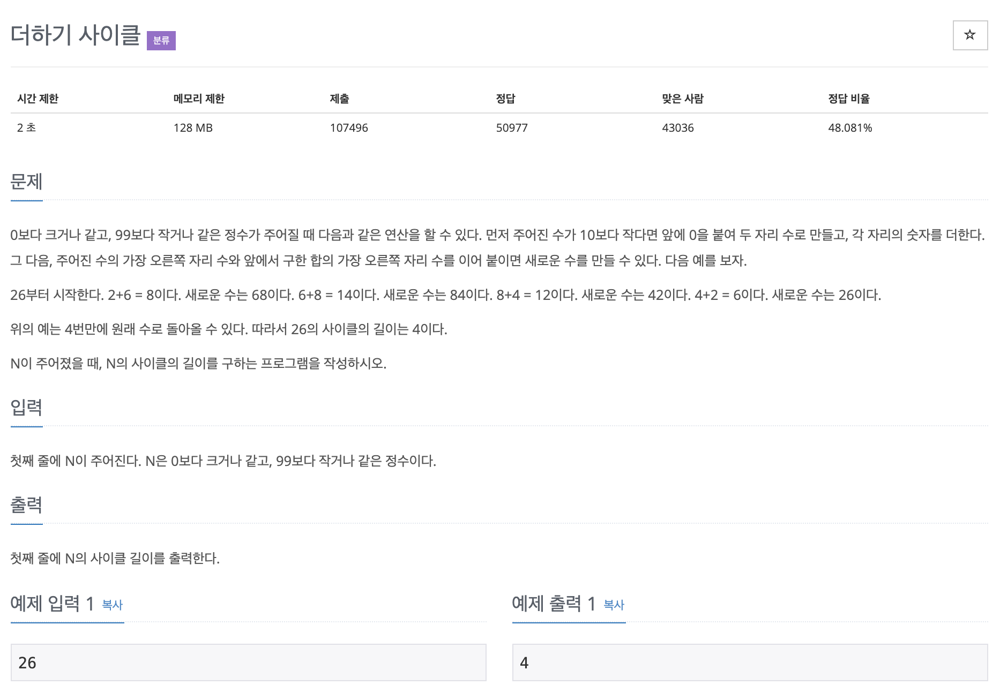

# 더하기 사이클

---

~~~
#include <iostream>
using namespace std;

int main(){

    int num;
    int num1, num2;  //십의 자리수, 일의 자리수
    int result, count;

    cin >> num;

    while(result != num){
        count++;
        num1 = num/10  // 십의 자리수
        num2 = num%10  // 일의 자리수
        
        result = num2*10 + (num1+num2)%10;
    }

    cout << count;

    return 0;
}
~~~