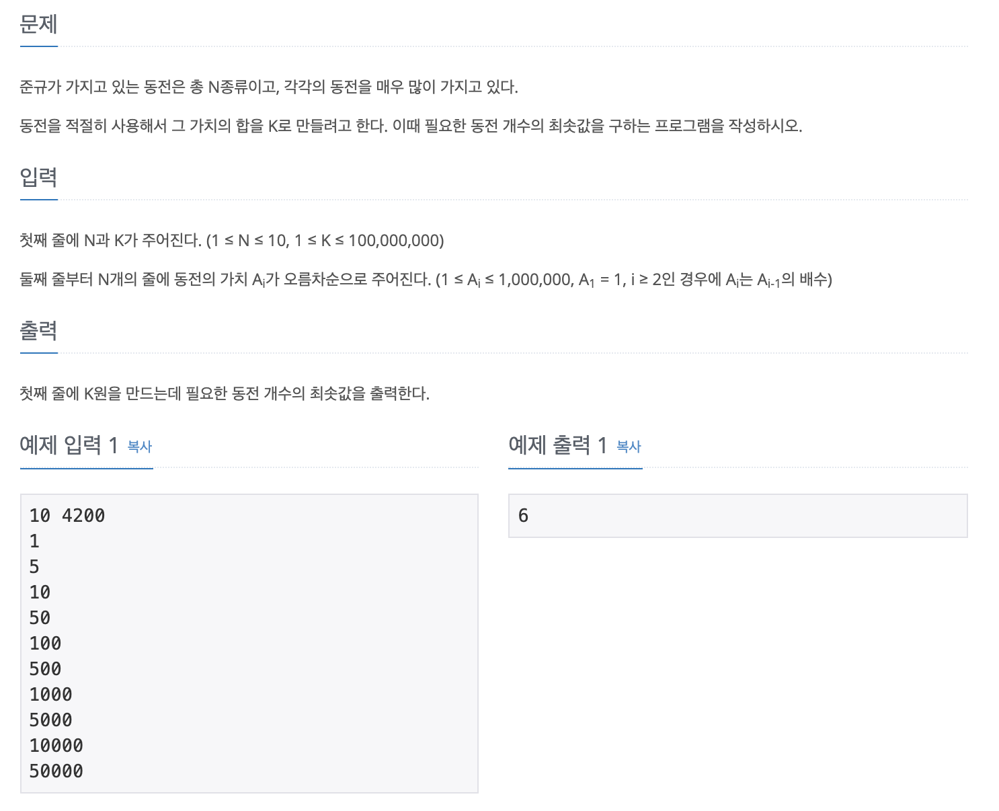

# 백준 동전 0

## 문제 분석
* 거스름돈 문제
* 화페가 단위가 다양하며 주어진 액수보다 클 경우가 존재한다.

---

## 소스코드1

### 알고리즘
* 몫(//), 나머지(%) 모두 실행한다.
* 액수를 넘을 경우 해당 작업은 넘어간다.

~~~
# N, K 입력
n, k = map(int, input().split())
# 동전 입력
coin = []
for i in range(n):
  coin.append(int(input()))

coin.reverse()
count = 0

for j in coin:
  if k < j:
    continue

  count += k // j
  k %= j 

print(count)
~~~