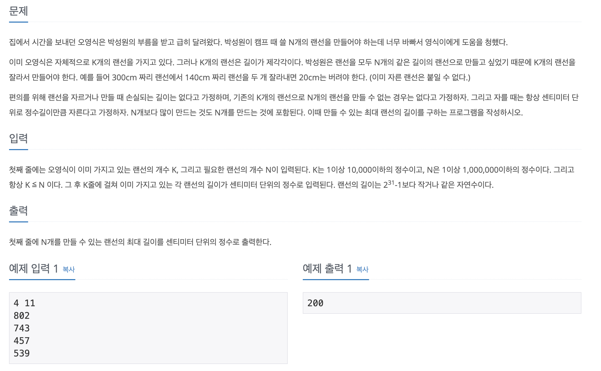

# 랜선 자르기

## 문제 분석
* 리스트로 주어진 값들에서 특정 개수만큼 어떤 값을 계산해야할 때 이 값이 최대가 되도록 설정해야 한다.
* 이진 탐색을 이용한다.  
---

## 소스코드1 

### 알고리즘
* 이진 탐색 이용
* 이분 탐색 대상(mid) : 길이가 가장 긴 랜선, 이분 탐색 조건: mid를 통해서 잘려진 랜선의 개수와 N

~~~
import sys
K, N = map(int, input().split())
lan = [int(sys.stdin.readline()) for _ in range(K)]
start, end = 1, max(lan) 

while start <= end: # 1단위로 최적의 지점을 찾는다. 
    mid = (start + end) // 2 
    
    lines = 0 # 랜선 개수 
    for i in lan:
        lines += i // mid  # '(랜선 길이) // mid' -> mid 길이만큼의 개수 계산
        
    if lines >= N: 
        start = mid + 1  # 길이를 늘린다. -> 라인 개수가 줄어든다.
    else:
        end = mid - 1  # 길이를 줄인다. -> 라인 개수가 늘어난다. 
print(end)
~~~

소스코드 출처: <https://claude-u.tistory.com/443>