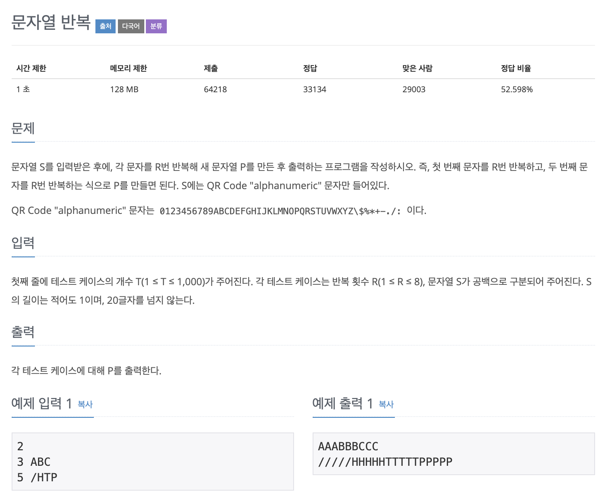

# 문자열 반복

---

## 소스코드 1 - c++

~~~
#include <iostream>
#include <string>
using namespace std;

int main(){

    int t, count = 0;
    string str;

    cin >> t;

    for(int i = 0; i < t; i++){

        cin >> count >> str;

        for(int j = 0; j < str.length(); j++){
            for(int k = 0; k < count; k++)
                cout << str[j];
        }
        cout << endl;
    }

    return 0;
}

~~~

