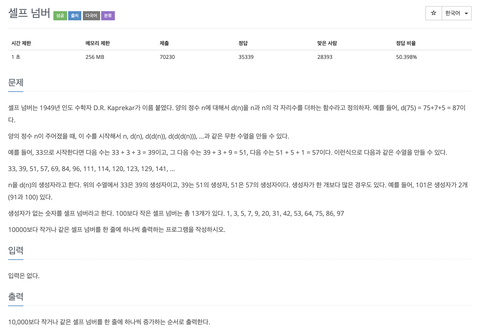

# 셀프 넘버

## 문제분석
* 특정 범위 안에서 조건을 만족하는 수가 몇개 존재하는가?

---

## 소스코드 1 - c++

### 알고리즘
* 모든 경우마다 배열을 둔다. 완전탐색으로 분석!!

~~~
#include <iostream>
using namespace std;

int func(int num){

  int result = num;

  while(num != 0){
    result += (num % 10);
    num /= 10;
  }

  return result;
}

int main(){

  bool array[10001]={false,};
  
  int start = 1;
  int result = 0;

  for(int i = 1; i < 10001; i++){

    result = func(i);
    if(result < 10001)
      array[result] = true;

  }

  for(int i = 1; i < 10001; i++){
    if(array[i] == false)
      cout <<  i << endl;
  }

    return 0;
}
~~~