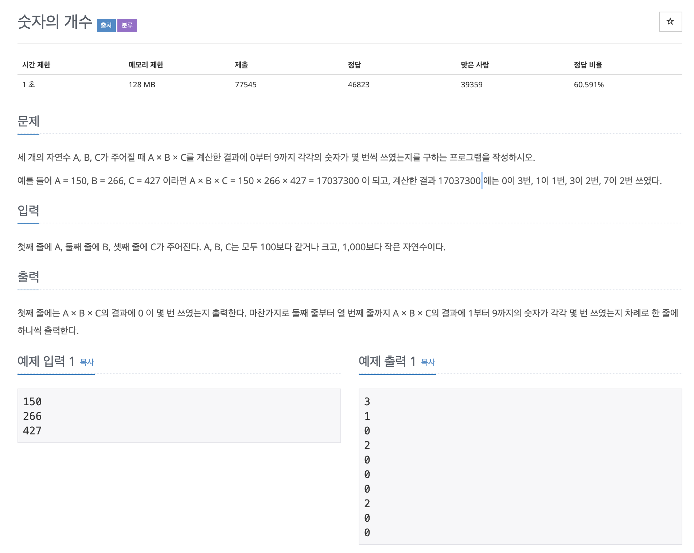

# 숫자의 개수

## 문제 분석
* 자릿수 별로 구분 문제

### 자릿수 구분
* 10으로 나눗셈을 하면 나머지와 몫의 정보를 얻느다.
* 나머지(%) : 첫째 자리 값 추출
* 몫(/) : 첫째 자리 값 제외한 나머지 값 추출!

---

## 소스코드1 - c++

### 알고리즘
* 인덱스가 값의 대상!

~~~
#include <iostream>

using namespace std;

int main(void){

    int a,b,c;
    cin >> a >> b >> c;

    int result = a*b*c;
    int array[10] = {0};

    while(result != 0){
        array[result % 10] += 1;
        result /= 10;
    }

    for(int i = 0; i < 10; i++){
        cout << array[i] << endl;
    }

}
~~~
