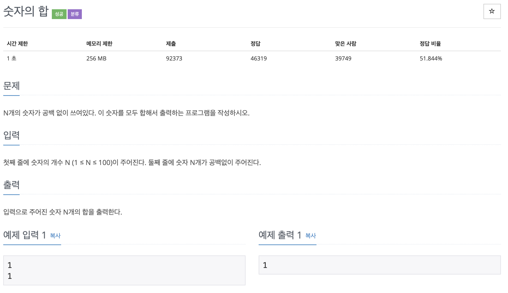

# 숫자의 합

## 문제 분석
* 숫자 형태의 문자를 다룬다. 각 숫자 문자도 다른 값이 할당되어 있다. 따라서 `'0'` 을 빼주어야 한다. 

---

## 소스코드 1 - c++

### 알고리즘
* 배열 크기 받은 후 배열 선언 가능
* **str[i]-'0'** 중요!
* int() 사용해도 그대로 출력 안된다.

~~~
#include <iostream>
using namespace std;

int main(){

  int n, result = 0;

  cin >> n;

  char str[n];

  cin >> str;

  for(int i = 0; i < n; i++){
    result += str[i]-'0';
  }

  cout << result;
    return 0;
}
~~~

## 소스코드 2 - c++

~~~
#include <iostream>
using namespace std;

int main(){

    int n, result = 0;
    unsigned long num;

    cin >> n >> num;

    while(n>0){
        result += num%10;
        num /= 10;
        n--;
    }

    cout << result;

    return 0;
}
~~~