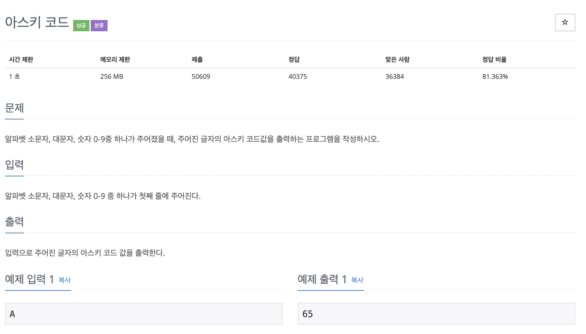

# 아스키 코드

---

## 소스코드1 - c++

~~~
#include <iostream>
using namespace std;

int main(){

    char str;

    cin >> str;
    cout << (int)str;

    return 0;
}
~~~

---

## 소스코드2 - python

~~~
str = input()
print(ord(str))
~~~