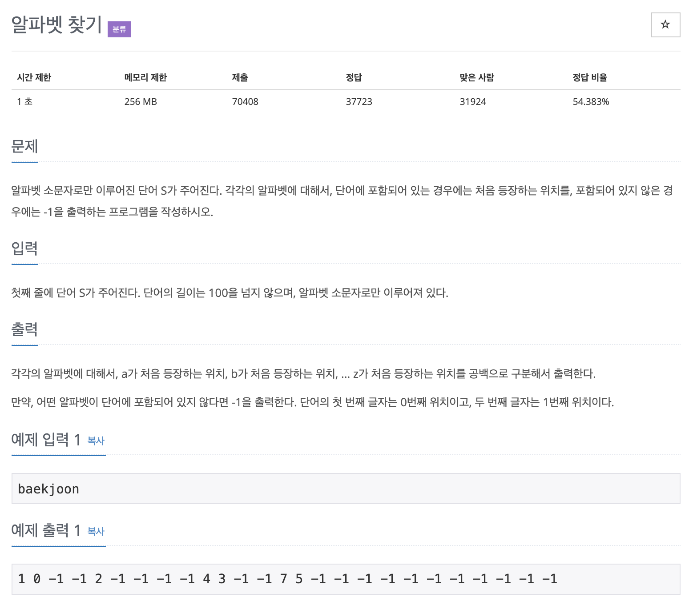

# 알파벳 찾기

## 문제 분석
* 숫자형 문자 다루기

---

## 소스코드1 - c++

### 알고리즘
* string 객체 메서드 `length()`, `find()` 사용

~~~
#include <iostream>
#include <string>

using namespace std;

int main(){
    string str;
    string alph ="abcdefghijklmnopqrstuvwxyz";
    cin >> str;
    for(int i = 0; i< alph.length(); i++){
        count << (int)str.find(alph[i]) << " ";
    }

    return 0;
}

~~~