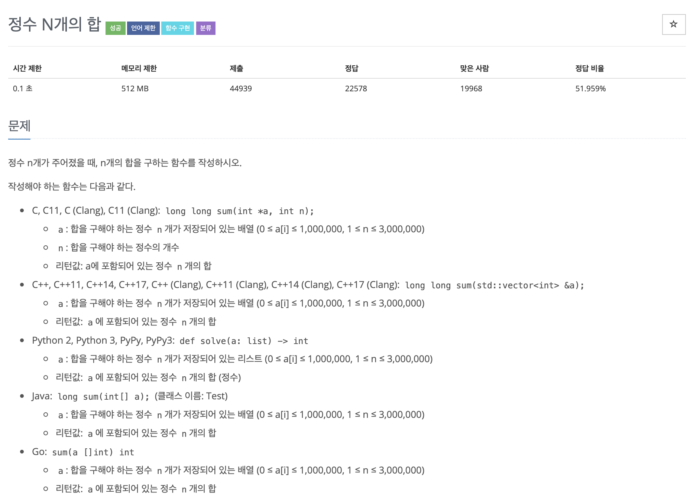

# 정수 N개의 합

---

## 소스코드1 - c++

~~~
#include <vector>
long long sum(std::vector<int> &a) {
	long long result = 0;
    
    for(int i = 0; i < a.size(); i++){
        result += a[i];
    }
    
	return result;
}

~~~