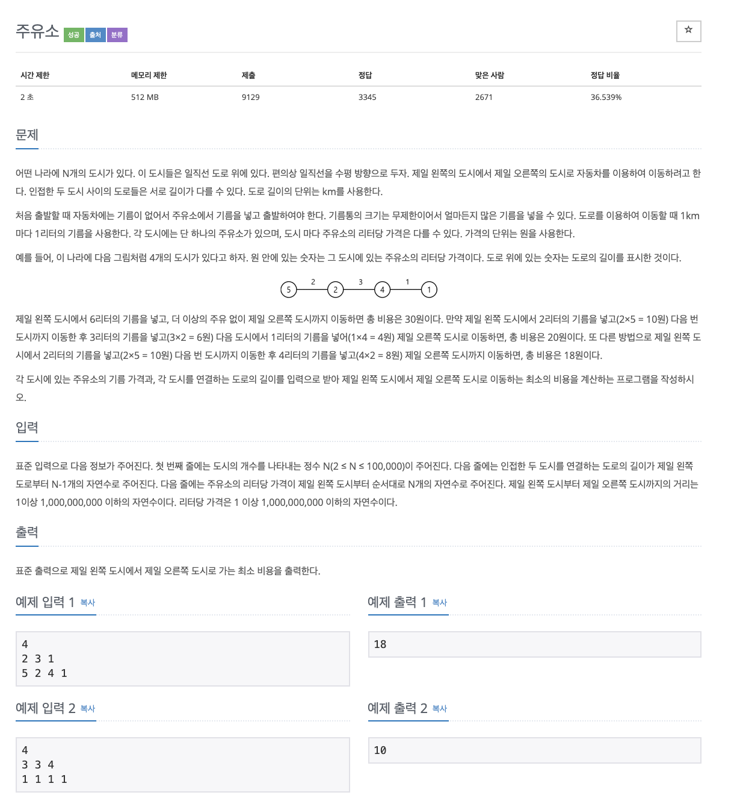

# 주유소

## 문제 분석
* 각도시에 리터당 가격의 값이 포함되어 있으며 도시간에는 거리값이 할당되어 있다. 거리당 1리터의 기름이 소요되며 첫번째 도시에서는 무조건 기름을 넣어야 한다. 
* 각 도시를 방문할 때 마다 현재 도시와 이전 도시 최솟값을 가진 도시를 비교하여 적은 도시의 기름을 사용하는 형태로 그리디 알고리즘을 구현한다. 

---

## 소스코드1

### 알고리즘
* 각 도시마다 반복하며 현재 도시의 기름값과 이전 도시 중 기름값이 최소인 도시 값을 비교한다. 

~~~
n = int(input())

# 거리 값
distance = list(map(int, input().split()))

# 기름 값
price = list(map(int, input().split()))

result = 0

min = 0

for cur in range(len(distance)):    
    if price[min] > price[cur]:
        min = cur
    result += price[min]*distance[cur]

print(result)

~~~