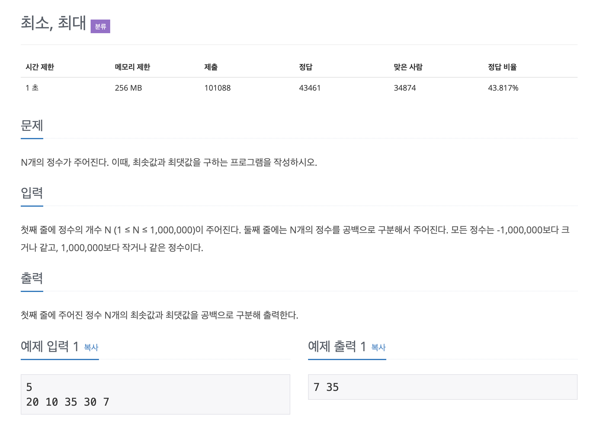

# 최대, 최소

## 문제 분석
* 최대, 최소 값 구하기

---

## 소스코드 1 - c++

### 알고리즘
* 최대, 최소 변수를 필요
* 모든 원소 2번씩 각각 비교!!

~~~
#include <iostream>

using namespace std;

int main(){

    int count;
    int min = 1000000;
    int max = -1000000;

    cin >> count;
    
    int array[count];

    for(int i = 0; i < count; i++){

        cin >> array[i];

        if(max < array[i])
            max = array[i];
        
        if(min > array[i])
            min = array[i];
    }

    cout << min << ' '  << max;

    return 0;
}
~~~

## 소스코드 2 - python
~~~
n = int(input())

array = list(map(int, input().split()))

print(min(array), end = ' ')
print(max(array))
~~~