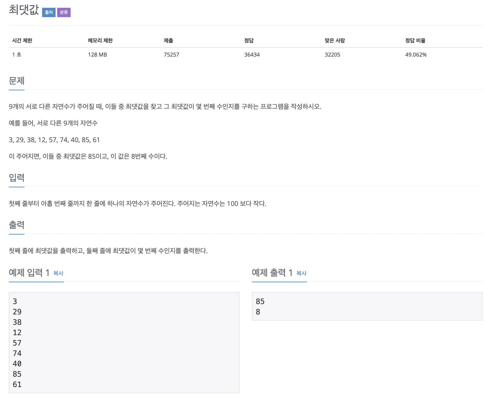

# 최댓값

## 문제 분석 
* 최댓값 구하기

---

## 소스코드1 - c++

~~~
# include <iostream>
using namespace std;

int main(){

    int max = -1000000;

    int array[9];
    int index = -1;

    for( int i = 0; i < 9; i++){

        cin >> array[i];

        if(max < array[i]){
            max = array[i];
            index = i;
        }
    }

    cout << max << '\n' << index+1;

    return 0;
}
~~~

