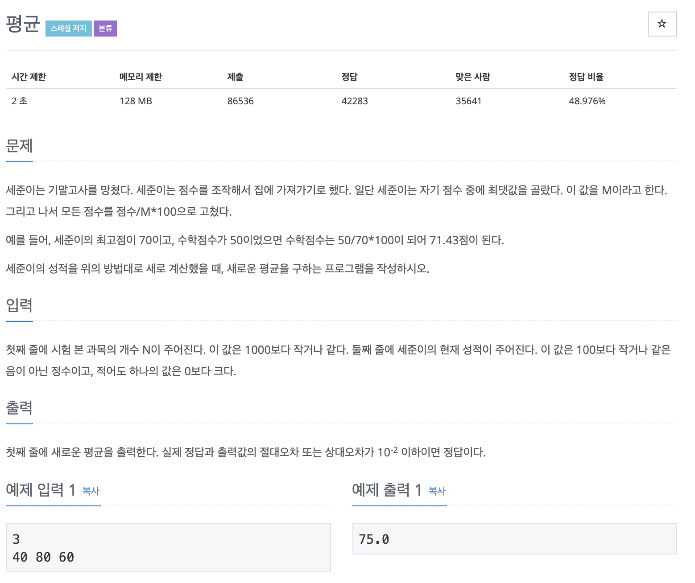

# 평균

---

## 소스코드1 - c++

~~~
#include <iostream>
using namespace std;

int main(){

    int count = 0;
    double max, sum = 0;

    cin >> count;

    double array[count];

    for(int i = 0; i<count; i++){
        cin >> array[i];
        if(max < array[i])
            max = array[i];
    }

    for(int i = 0; i<count; i++){
        array[i] = array[i]/max*100.0;
        sum += array[i];
    }

    cout << sum/(double)count;

    return 0;
}
~~~