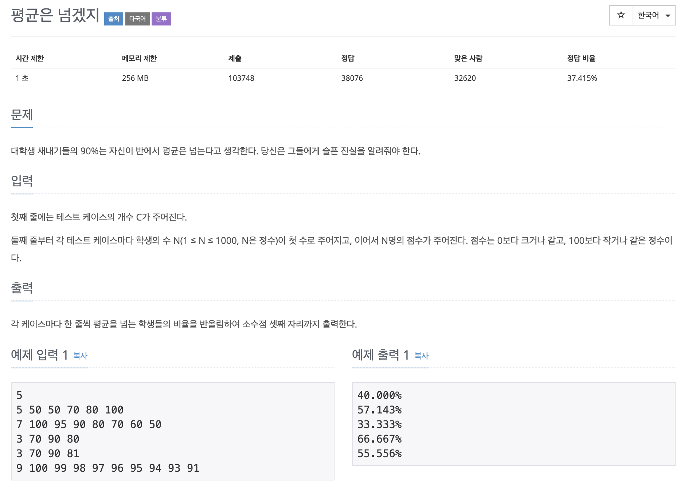

# 평균은 넘겠지

---

## 소스코드1

~~~
#include <iostream>
using namespace std;

int main(){

    int count, n, num;  //테스트 케이스, 학생수 
    int avg;
    int score[1000] = {0};  // 입력값 제한 -> 1 <= N <= 1000
    double result;

    cin >> count; //테스트 케이스
    for(int i = 0; i < count; i++){
        avg = 0;
        num = 0;
        cin >> n;  //학생 수 

        for(int j = 0; j < n; j++){
            cin >> score[j]; 
            avg += score[j];
        }

        avg = avg/n;
        
        for(int j = 0; j<n; j++){
            if(score[j] > avg)
                num++;
        }

        result = (double)num/n*100;

        cout << fixed;  // 소수점을 고정시켜서 표현!!
        cout.precision(3);  // 소수점 아래 3자리까지 고정시킴!
        cout << result << "%" << endl;

    }

    return 0;
}
~~~