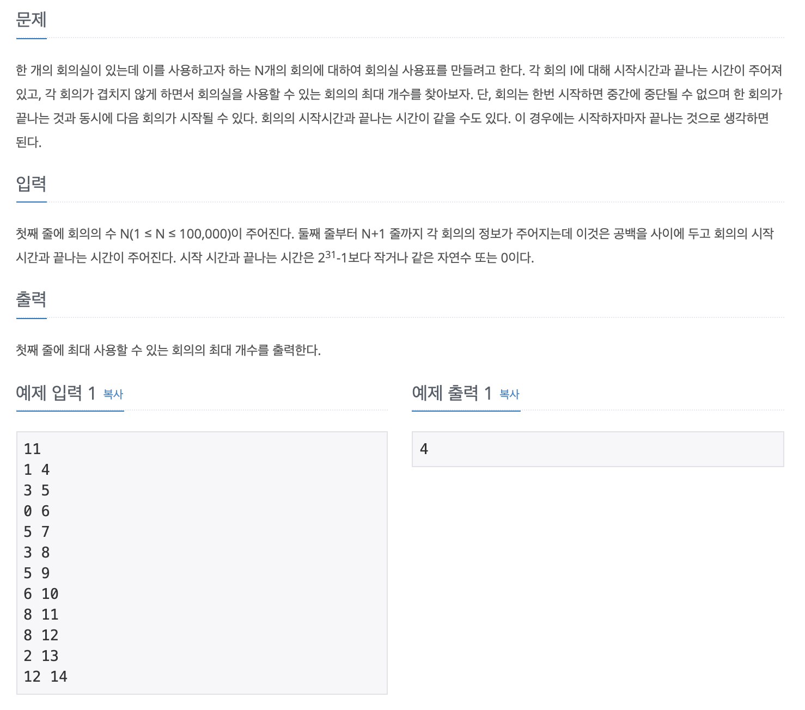

# 회의실 배정

## 문제 분석
* 대표 그리디 문제로 **시작 시간, 끝나는 시간**이 주어졌을 때 **겹치지 않게 최대한 많은 회의실**을 배정하는 문제

---

## 소스코드1

### 알고리즘
* 종료시간과 시작시간을 순차적으로 오름차순 정렬한다.
* 종료시간을 담을 변수를 선언한 후 이를 통해 다음에 시작될 회의실의 시작시간과 종료시간을 처리한다. 

~~~
n = int(input())

array = []

for _ in range(n):
    array.append((list(map(int, input().split()))))

# 종료시간, 시작시간으로 오름차순 정렬!
array_sort = sorted(array, key = lambda x:(x[1], x[2]))

room = 0  # 배정된 회의실 개수
end_time = 0  # 종료시간 0으로 초기화

# 모든 회의실 탐색
for i in range((len(array_sort))):
    # 현재 회의실의 종료시간과 다음에 가장 먼저 시작하는 회의실을 찾는다. 
    if end_time <= array_sort[i][0]:  # 종로시간 <= 시작시간
        end_time = array_sort[i][1]  # 할당된 회의실의 종료시간 할당
        room += 1
~~~